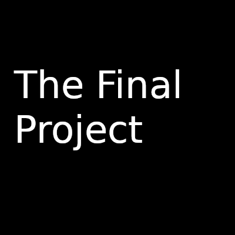

# The Final Project!

For this assignment you are going to be building a 'Game Maker' as your final project! 

You will have some flexibility and creativity in how the overall game making engine is built and what types of game(s) your engine can make.

## Logistics

- You will be working on this assignment as a team on your choice (or a combination) of the Mac, Linux, or Windows Operating Sytstem.
- You will put all of your code and deliverables in the [Engine](./Engine) directory.
- Make sure everyone has a way to work on this codebase, with a common set of tools.
- Everyone should make code contributions to the repository (i.e. everyone should have some commits in the project log)

## Team

Team Name: *Edit this to something cool here*

*TODO*:
Update your Team member Names here (Up to 4).

1. *my name is...*
2. *my name is...*
3. *my name is...*
4. *my name is...*

## Assignment Milestones

1. [Part 1 README](./part1_README.md) 
 	* Read the project description
2. [Part 2 README](./part2_README.md) 
 	* More specific requierments of the project and who is going to be responsible for each part
3. [Part 3 README](./part3_README.md) 
 	* Portfolio instructions 	
4. Team member Evaluation: https://forms.gle/qiD6guzN5W5LxAcV9
 	* **This must be filled out before the project is due.**

## Universal Resources

You will be using SDL2 to build this project. Make sure you can run SDL by following the instructions here: 
(Note you do not need to glad library, unless you are doing additional work with OpenGL 3.3+)

* General SDL2 programming tutorials: 
  * http://lazyfoo.net/tutorials/SDL/
* General SDL2 setup [Full SDL playlist](https://www.youtube.com/watch?v=QM4WW8hcsPU&list=PLvv0ScY6vfd-p1gSnbQhY7vMe2rng0IL0)
  * Linux: https://www.youtube.com/embed/xNCFSMkpwWo
  * Windows: https://www.youtube.com/embed/nZbytgAhvoY
  * Mac: https://www.youtube.com/embed/xVl1ysRj_lQ

# Part 1 and 2 Rubric (75%)
   
<table>
  <tbody>
    <tr>
      <th>Points</th>
      <th align="center">Description</th>
    </tr>	  
    <tr>
      <td>25% (Engineering/Design Patterns)</td>
      <td align="left">On the polish of your final project (did it work as intended, were there bugs, did I have to struggle to get your tool running, was your solution well engineered, were there patterns used, etc.)</td>
    </tr>
    <tr>
      <td>40%  (Requirements)</td>
      <td align="left">Did you complete all of the requirements from part 2?</td>
    </tr>
    <tr>
      <td>10%% (Wow Factor)</td>
      <td align="left">On the creativity and overall 'wow' factor of your project. Was there a cool feature or surprise that got me excited about the project? Does this project have potential to be extended in the future? Were there creative additional tools that supported your work. Was there something not covered in class that you were excited about, learned, and implemented anyway? (Document this to bring to my attention if so!)</td>
    </tr>
  </tbody>
</table>

# Part 3 - Rubric (20%)

<table>
  <tbody>
    <tr>
      <th>Points</th>
      <th align="center">Description</th>
    </tr>
    <tr>
      <td>4% (Engine Architecture diagram)</td>
      <td align="left">Did you add the engine architecture diagram to your website "./media/C4Engine.pdf"?</td>
    </tr>   	  
    <tr>
      <td>4% (Documentation)</td>
      <td align="left">Did you generate something like "http://www.horde3d.org/docs/html/_api.html"?</td>
    </tr>    
    <tr>
      <td>4% (Build)</td>
      <td align="left">Does the build work when I download your repo and run the game?</td>
    </tr>
    <tr>
      <td>4% (Post mortem)</td>
      <td align="left">Did you learn anything and provide a brief and well-thought out reflection of these learnings?</td>
    </tr>
    <tr>
      <td>4% (Website)</td>
      <td align="left">Do you have a webpage that presents your project in a positive way with the above materials.</td>
    </tr>
  </tbody>
</table>

# Teammate Evaluation - Rubric (5%)

<table>
  <tbody>
    <tr>
      <th>Points</th>
      <th align="center">Description</th>
    </tr>
    <tr>
      <td>5% (Team member evaluation)</td>
      <td align="left">Did you fill it out? How did your teammates rate you?</td>
    </tr> 
  </tbody>
</table>

**Note: Everyone on your team earns the same grade for all parts of the project.**

## Notes on working in teams

* Pragmatically
	* It is useful to work in separate branches in git, and then merge your code to master, and then resolve the merge conflicts (ideally with the person you are working with).
	* If you are uncomfortable with this in github, then pair programming may be a viable option (I do however want to see commits from everyone).
* On working with others
	* Be responsive
		* Check your email, respond to your teammates within 24-48 hours on the preferred communication platform
	* Be proactive
		* Alert the course staff if there are issues sooner rather than later--we cannot do anything the last day before the project is due.
	* Contribute
		* The course staff looks at the commit logs to make sure everyone participated (No free rides--earn your grade!)
		* Note: One team member doing all the work is not heroic either
			* Balance the work load--no one should complete more than 50% of the project on a 4 person team for example.

#### More Resources on working in Teams

* [What Makes a Winning Game Development Team?](http://www.bitmascot.com/what-makes-a-successful-game-team/)
* [The 3 C's of being a captain](https://appliedsportpsych.org/resources/resources-for-athletes/the-3-c-s-of-being-a-captain/)
* [Etiquette for Pair Programming](https://dzone.com/articles/etiquette-for-pair-programming)
